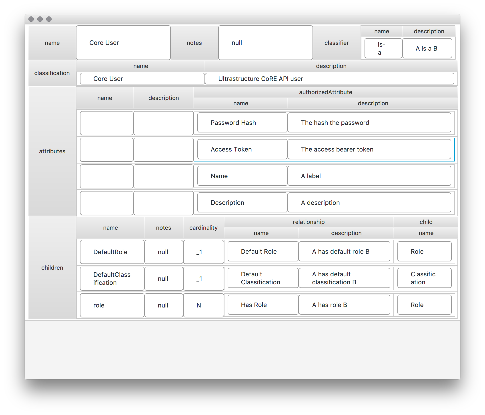

# Kramer

Automatic layout of structured hierarchical JSON data — JavaFX and TypeScript/React.

[](https://github.com/ChiralBehaviors/Kramer/actions/workflows/maven.yml)
[](LICENSE)

Kramer implements the algorithm from [Automatic Layout of Structured Hierarchical Reports](http://people.csail.mit.edu/ebakke/research/reportlayout_infovis2013.pdf) (Bakke, InfoVis 2013). Given a schema and JSON data, it produces an adaptive layout that switches between outline and nested table views based on available width. The result is a dense, multicolumn hybrid that handles arbitrary nesting depth.

Available in both **Java/JavaFX** and **TypeScript/React**.



## Building

Requires Maven 3.3+ and Java 25+. TypeScript packages require pnpm.

```bash
# Build everything (Java + TypeScript)
mvn clean install

# Java only
mvn -pl kramer install

# TypeScript only
cd js && pnpm install && pnpm run -r test
```

## Modules

### Java

| Module | Description |
|--------|------------|
| [kramer](kramer/) | Core layout engine. Schema-driven layout of JSON into JavaFX controls. |
| [kramer-ql](kramer-ql/) | GraphQL integration. Parses queries into Kramer schemas, executes via Jakarta RS. |
| [explorer](explorer/) | Interactive app for exploring GraphQL endpoints with autolayout. Includes `StandaloneDemo`. |
| [toy-app](toy-app/) | Declarative single-page app framework using GraphQL + autolayout. |

### TypeScript ([js/](js/))

| Package | Description |
|---------|------------|
| [@kramer/core](js/packages/core/) | Schema, layout pipeline, expression language, query state. Zero DOM dependency. |
| [@kramer/measurement](js/packages/measurement/) | Browser and approximate text measurement strategies. |
| [@kramer/graphql](js/packages/graphql/) | GraphQL query parsing, AST expansion, introspection. |
| [@kramer/react](js/packages/react/) | React renderer — AutoLayout, Table, VirtualOutline, ColumnHeader. |
| [@kramer/react-ui](js/packages/react-ui/) | Interaction panels — FieldSelector, FieldInspector. |

## How it works

The layout pipeline:

1. **Schema** — a tree of `Relation` (composite) and `Primitive` (leaf) nodes describing the JSON structure
2. **Measure** — statistical content-width measurement (P90) determines natural column widths
3. **Layout decision** — a constraint solver chooses table or outline mode per relation, maximizing information density while ensuring readability
4. **Justify** — two-pass width distribution guarantees every column gets at least its label width before distributing surplus proportionally
5. **Compress** — DP-optimal column partitioning (painter's partition) packs fields into multicolumn layouts
6. **Build** — platform-specific control tree (JavaFX or React)

The layout is fully reactive — resizing the window re-runs the pipeline and may switch between table and outline modes at different nesting levels.

## Key features

- Adaptive table/outline hybrid layout
- Constraint solver for global render-mode optimization
- Expression language for per-row filter, formula, sort, and aggregate operations
- Interactive query state (sort, filter, visibility, render mode) with undo/redo
- Context menus, field selector panel, field inspector, keyboard shortcuts
- Virtualized scrolling for large datasets
- CSS-driven styling with schema-aware class names
- Cross-language contract tests ensure Java and TypeScript produce identical layout decisions

## Running the demos

### Java (JavaFX)

```bash
cd explorer && mvn package
java -jar target/explorer-0.0.1-SNAPSHOT-phat.jar
```

Point at any GraphQL endpoint. Or run the standalone demo (no endpoint needed):

```bash
java -cp target/explorer-0.0.1-SNAPSHOT-phat.jar com.chiralbehaviors.layout.explorer.StandaloneDemo
```

### TypeScript (React)

```bash
cd js && pnpm install && pnpm --filter @kramer/react dev
```

Opens a browser with the course catalog demo. Resize to see table ↔ outline switching.

## Tests

1300 tests total (1143 Java + 157 TypeScript), all passing.

```bash
# Run everything
mvn test

# Java only
mvn -pl kramer test

# TypeScript only
cd js && pnpm run -r test
```

## Using as a library

### Java

```xml
<dependency>
    <groupId>com.chiralbehaviors.layout</groupId>
    <artifactId>kramer</artifactId>
    <version>0.0.1-SNAPSHOT</version>
</dependency>
```

### TypeScript

```typescript
import { relation, primitive, measureRelation, solveConstraints } from '@kramer/core';
import { AutoLayout } from '@kramer/react';

const schema = relation('items', primitive('name'), primitive('price'));
const data = [{ name: 'Widget', price: 9.99 }];

// React component
<AutoLayout schema={schema} data={data} />
```

## License

Apache 2.0 — see [LICENSE](LICENSE).
