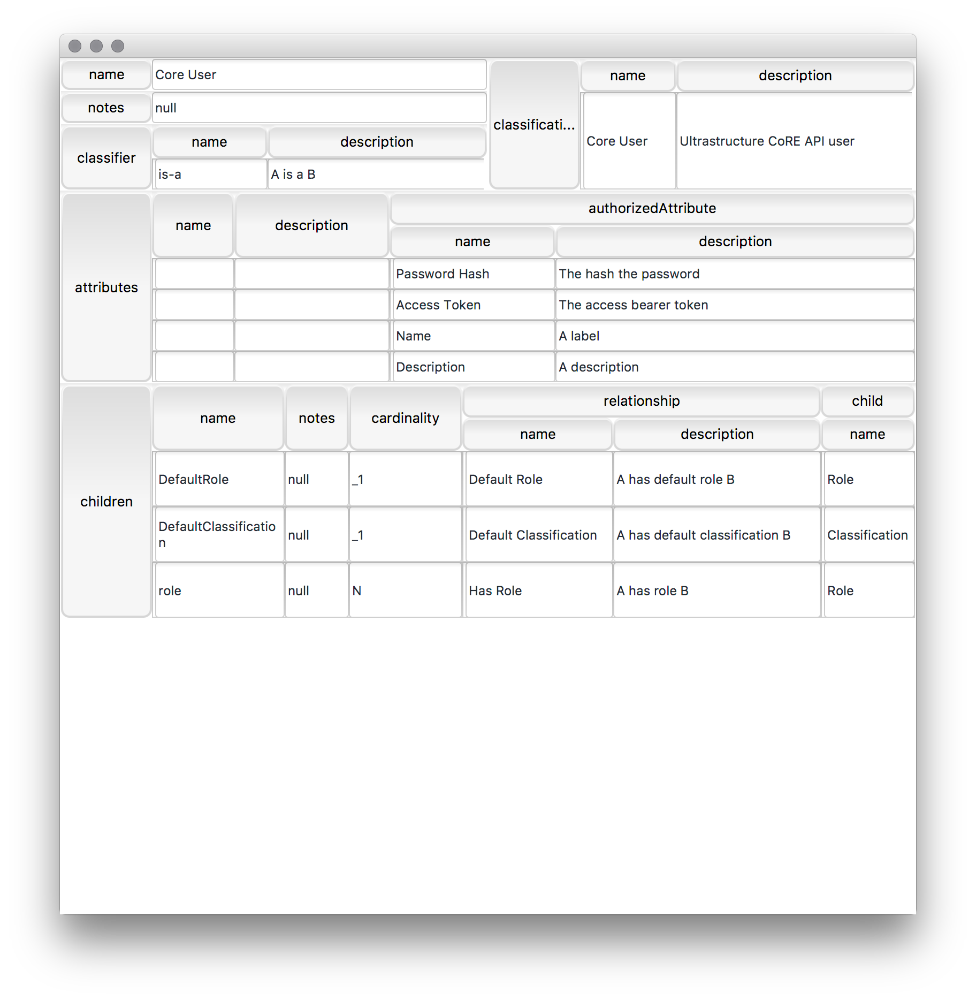

# Kramer Umbrella application

<h2 style="text-align: center;" markdown="1">Automatic layout of structured hierarchical data, graphQL generic single page applications, and a floor wax</h2>

It's all about levels.

### Building
Kramer requires [maven 3.3+](https://maven.apache.org =800x600), Java 1.8+.  To build Kramer, cd to the top level directory:

    mvn clean install
    
Individual modules may be built independently.

### License
Kramer is licensed under [Apache 2.0 license](LICENSE)

## What it does
Kramer is based on the system described in the paper [Automatic Layout of Structured Hierarchical Reports](http://people.csail.mit.edu/ebakke/research/reportlayout_infovis2013.pdf).  Kramer uses a schema to automatically layout structured JSON.  The layout is adaptive between outline and nested table views, providing multicolumn hybrids that are dense and is highly usable.  One could call it the Unicorn of reactive layouts for hierarchical data (and who doesn't have that, amirite?).

Kramer uses JSON, via the excellent [Jackson library](https://github.com/FasterXML/jackson).  Combined with the schema that describes the JSON data, Kramer provides a simple [JavaFX](http://docs.oracle.com/javase/8/javafx/get-started-tutorial/jfx-overview.htm#JFXST784) control that exposes the automatic layout.  Kramer uses the [Jackson TreeModel](http://wiki.fasterxml.com/JacksonTreeModel), focussing on the JsonNode as the data model used by the framework.

For more information, see the [Kramer Wiki](https://github.com/ChiralBehaviors/Kramer/wiki)

## Guide to this build

There are currently four modules that compose Kramer:

 - [Kramer Core](kramer/README.md) - the core autolayout framework
 - [Kramer QL](kramer-ql/README.md) - [GraphQL](http://graphql.org) integration into the Kramer framework
 - [AutoLayout Explorer](explorer/README.md) - A simple application to explore GraphQL endpoints with the Kramer autolayout framework
 - [Toy Single Page UI App Framework](toy-app/README.md) - A sketch of an idea I've had for some time, using Kramer to provide the UI for a declarative single page UI application framework using [GraphQL](http://graphql.org).

## Using Kramer

From maven, you'll need to add the Chiral Behaviors repository:
    
	<repository>
		<id>chiralbehaviors-snapshots</id>
		<url>http://repository-chiralbehaviors.forge.cloudbees.com/snapshot/</url>
		<snapshots>
			<enabled>true</enabled>
		</snapshots>
	</repository>

For [Kramer core](kramer/README.md):

    
	<dependency>
		<groupId>com.chiralbehaviors.layout</groupId>
		<artifactId>kramer</artifactId>
		<version>0.0.1-SNAPSHOT</version>
	</dependency>

For [Kramer QL](kramer-ql/README.md):

	<dependency>
		<groupId>com.chiralbehaviors.layout</groupId>
		<artifactId>kramer-ql</artifactId>
		<version>0.0.1-SNAPSHOT</version>
	</dependency>

For [Kramer AutoLayoutExplorer](explorer/README.md):

	<dependency>
		<groupId>com.chiralbehaviors.layout</groupId>
		<artifactId>explorer</artifactId>
		<version>0.0.1-SNAPSHOT</version>
	</dependency>

For [Kramer Toy Single Page UI Application Framework](toy-app/README.md):

	<dependency>
		<groupId>com.chiralbehaviors.layout</groupId>
		<artifactId>toy-app</artifactId>
		<version>0.0.1-SNAPSHOT</version>
	</dependency>